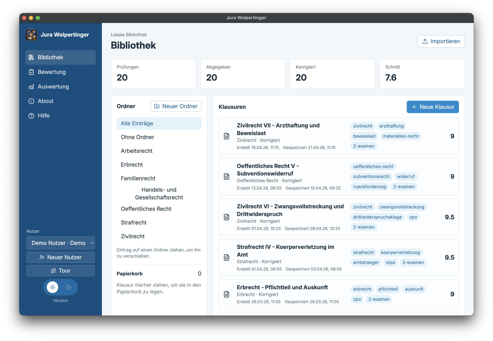
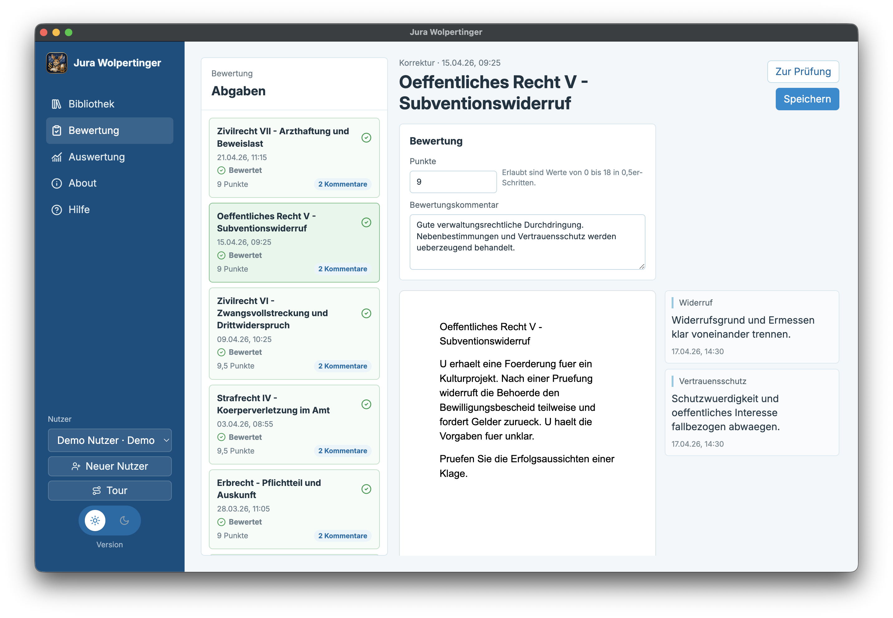
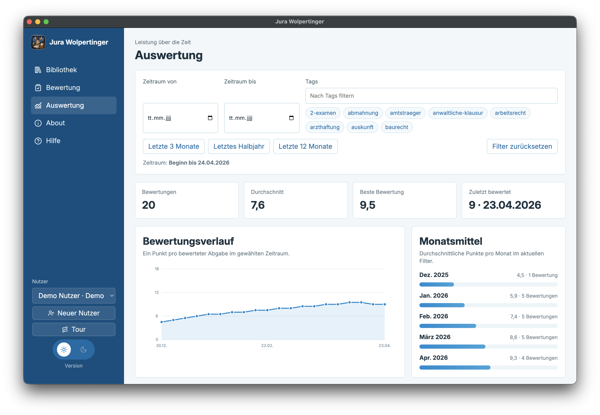
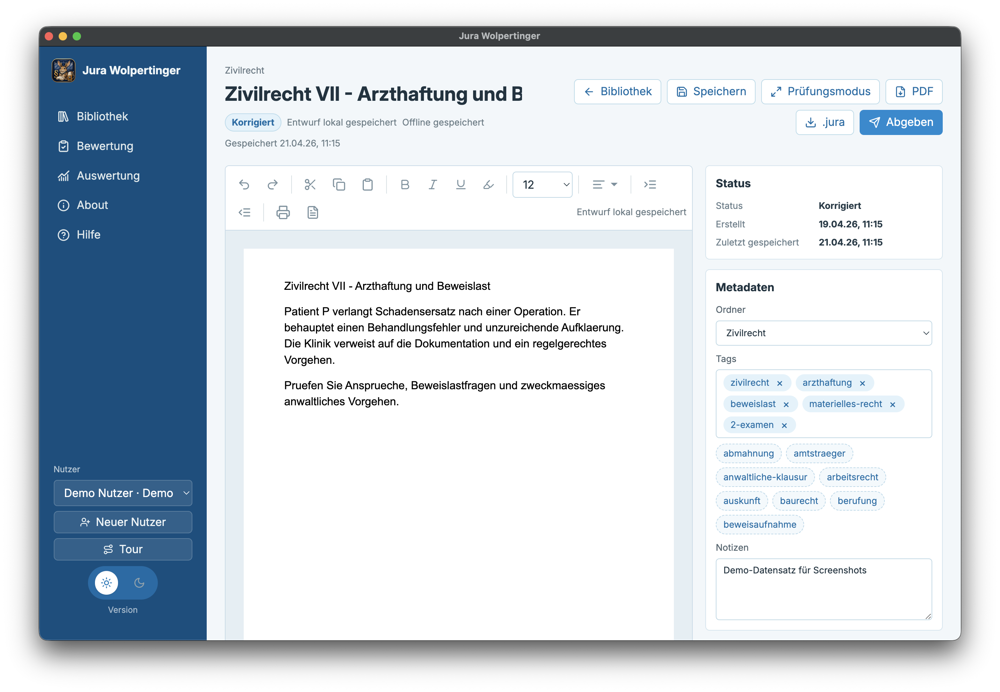
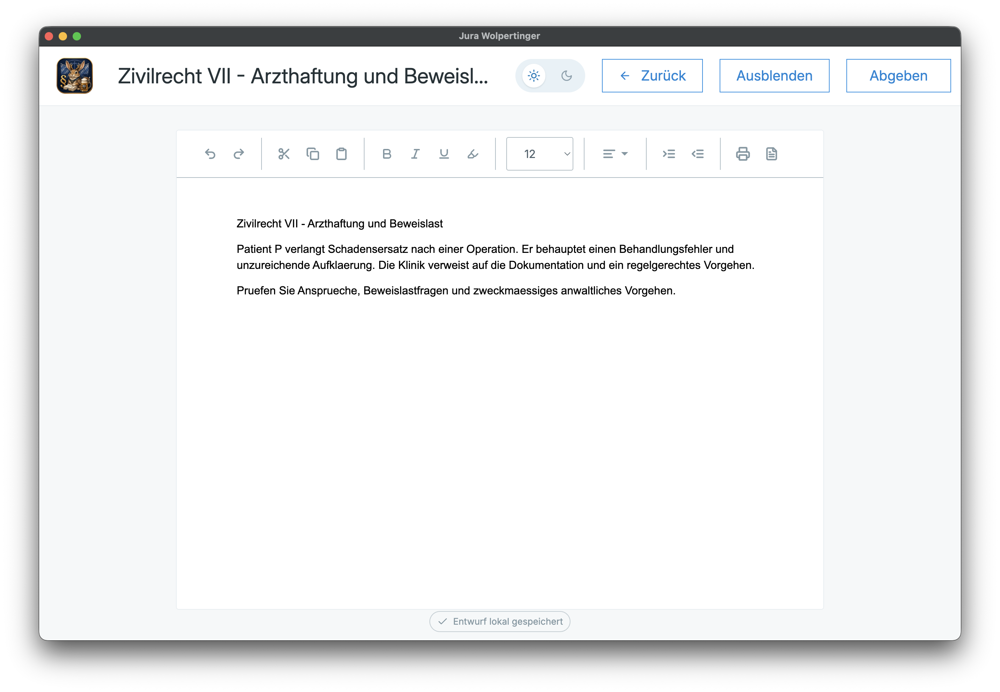

<p align="center">
  
</p>

# Jura Wolpertinger

Jura Wolpertinger ist eine offline-ready Desktop-App für juristische Prüfungen in Bayern. Sie hilft beim Schreiben, Abgeben, Korrigieren, Exportieren und Auswerten von Übungsprüfungen, ohne Cloud, Account oder Serverzwang.

Die App ist ein Freizeitprojekt. Sie ist nicht offiziell, nicht mit Classtime oder bayerischen Prüfungsstellen verbunden und ersetzt keine echte Prüfungsumgebung. Der Anspruch ist praktischer: Wer zu Hause oder in der Lerngruppe prüfungsnah üben will, soll sich mit einer reduzierten Schreiboberfläche vertraut machen, Abgaben lokal festhalten und die eigene Entwicklung nachvollziehen können. Entwürfe werden laufend lokal gespeichert, sodass Arbeit auch bei Stromausfall, leerem Akku oder App-Absturz nicht einfach im Browser-Tab verschwindet.

## Die Idee

<p align="center">
  
</p>

In der kleinen Geschichte hinter dem Projekt begleitet Wolpi, der Jura-Wolpertinger, Studierende durch ihre Übungsprüfungen. Er macht keine Rechtsberatung, kennt keine geheimen Prüfungstricks und bewertet auch nicht selbst. Er sorgt nur dafür, dass der Schreibplatz ruhig bleibt, die Abgabe gespeichert ist und später klar sichtbar wird, was sich verbessert hat.

Die App ist bewusst lokal und schlicht gebaut. Eine Prüfung soll sich anfühlen wie ein konzentrierter Arbeitsmodus: schreiben, speichern, abgeben, korrigieren, auswerten. Alles bleibt auf dem eigenen Rechner und funktioniert auch ohne Internetverbindung.

## Funktionsumfang

- lokale Bibliothek für mehrere Prüfungen
- lokale Nutzerprofile mit UUID, schnellem Wechsel und getrenntem Onboarding-Status
- Demo-Nutzer mit lokal geladenen Beispieldaten für Screenshots und UI-Tests
- Ordnerverwaltung mit Drag-and-Drop
- Papierkorb für Ordner mit Soft-Delete statt hartem Löschen
- lokales Dateisystem pro Prüfung für Anhänge und relevante Dateien
- prüfungsnaher Schreibmodus mit reduzierter Toolbar
- Fokus-/Prüfungsmodus mit hellem und dunklem Layout
- Offline-Betrieb ohne Serverpflicht
- Autosave und manuelles Speichern in lokale SQLite-Revisionen
- robuste lokale Persistenz, damit Klausuren nach Stromausfall oder Absturz wiederhergestellt werden können
- Abgabe als unveränderlicher Snapshot
- visuelles Abgabe-Overlay mit Wolpi-Bild
- `.jura` Export und Import als ZIP-basiertes Paketformat
- PDF-Export
- Korrekturansicht mit Gesamtbewertung nach Bayern `0-18`, inklusive halber Punkte
- Bewertungskommentar und Inline-Kommentare auf Textauswahlen
- Tag-System mit Chip-Eingabe und Vorschlägen
- Auswertungsseite mit Zeitraumfilter, Tag-Filter, Presets und Charts
- Onboarding-Tour mit Driver.js und Hilfeseite mit FAQ
- versionierte Datenstruktur mit SQLite-Migrationen

## Screenshots

### Bibliothek



### Bewertung



### Auswertung



### Klausur bearbeiten



### Prüfungsmodus



## Stack

- Electron
- Electron Vite
- Vue 3
- TypeScript
- Pinia
- Vue Router
- TipTap / ProseMirror
- SQLite via `better-sqlite3`
- `jszip` für `.jura`
- `zod` für Validierung
- Vitest
- Playwright

## Projektstruktur

```text
assets/                         zentrale Quellen für App-Assets
build/                          generierte Build-Assets, z.B. App-Icons
scripts/                        Build-Hilfsskripte
src/main/                       Electron Main Process, SQLite, Datei- und Exportlogik
src/preload/                    sichere IPC-Bridge
src/renderer/                   Vue-App
src/shared/                     gemeinsame Typen, Schemas und Konstanten
tests/                          Unit-, Service- und E2E-Tests
```

## Dokumentation

Die technische Architektur mit Datenbankdiagramm, Datenfluss, Statusmodell, `.jura` Paketformat, Migrationslogik und Auswertungs-Charts steht in [docs/architecture.md](docs/architecture.md).

Die Installation für Windows, macOS und Linux inklusive Signatur-/Zertifikatshinweisen steht in [docs/installation.md](docs/installation.md).

Das Nutzer- und Synchronisationskonzept ist in [docs/sync-and-users.md](docs/sync-and-users.md) beschrieben.

Die GitHub-Pages-Landingpage liegt in [docs/index.html](docs/index.html) und wird über [.github/workflows/pages.yml](.github/workflows/pages.yml) veröffentlicht.

Agent- und CI-Regeln stehen in [AGENTS.md](AGENTS.md), [docs/user-stories.md](docs/user-stories.md) und [docs/ci-guidelines.md](docs/ci-guidelines.md).

## Lokale Daten

Die App speichert Daten lokal unter Electron `app.getPath("userData")`. Im Development nutzt sie `.dev-data/`, damit Demo- und Screenshot-Daten getrennt von echten lokalen App-Daten bleiben.

Typische Struktur:

```text
database.sqlite
files/exams/<examId>/attachments/...
files/exams/<examId>/exports/...
backups/...
```

Die strukturierte Persistenz liegt in SQLite. Jeder Autosave und jedes manuelle Speichern erzeugt eine lokale Revision; Abgaben bleiben als eigener Snapshot erhalten. Dateien werden in den App-Speicher kopiert, nicht nur verlinkt. Dadurch sind Klausuren nicht von einer Internetverbindung abhängig und bleiben auch nach einem Neustart verfügbar.

Alle fachlichen Daten hängen an einer Nutzer-UUID. Dadurch können lokale Nutzerprofile getrennt arbeiten und später mit serverseitigen Konten verknüpft werden, ohne dass lokale Daten vorschnell überschrieben werden.

## `.jura` Dateien

`.jura` ist das lokale Austauschformat der App. Technisch ist es ein ZIP-Paket mit Manifest, Dokumentdaten, Revisionen, Abgaben, Korrekturen und Anhängen.

Importe werden validiert. Unbekannte neuere Formatversionen sollen abgelehnt werden, damit keine Daten stillschweigend falsch gelesen werden.

## Assets

Die zentrale Quelle für das Abgabe-Bild ist:

```text
assets/submission.png
```

Der Renderer bekommt dieses Bild automatisch über die Vite-Konfiguration gespiegelt. Für App-Icons ist die zentrale Quelle:

```text
assets/icon.png
```

Icons für Packaging werden über `pnpm run build:icons` erzeugt.

## Entwicklung

Voraussetzungen:

- Node.js
- pnpm
- macOS für den aktuellen Packaging-Flow mit `.icns`

Setup:

```bash
pnpm install
pnpm dev
```

Wenn der Standard-Port belegt ist, wählt Vite automatisch einen freien Port.

## Checks

```bash
pnpm run typecheck
pnpm test
pnpm run test:e2e
pnpm run build
```

Hinweis: `better-sqlite3` ist ein natives Modul. Die Tests und Electron-Starts rebuilden es teilweise für unterschiedliche Runtimes.

## Build und Packaging

Produktionsbuild:

```bash
pnpm run build
```

Lokales App-Bundle:

```bash
pnpm run dist:dir
```

macOS DMG/ZIP:

```bash
pnpm run dist:mac
```

Allgemeiner Packaging-Flow:

```bash
pnpm run dist
```

## Status

Das Projekt ist ein lokales MVP mit wachsendem Funktionsumfang. Es ist für Übung, private Vorbereitung und nicht-kommerzielle Nutzung gedacht.

Nicht im Scope:

- echte Prüfungszulassung
- offizielle Abgabe an Prüfungsstellen
- Cloud-Sync
- produktiver Account-Login
- Ende-zu-Ende-Verschlüsselung
- Rechtsberatung

## Lizenz

Dieses Projekt steht unter der **PolyForm Noncommercial License 1.0.0**.

SPDX:

```text
PolyForm-Noncommercial-1.0.0
```

Kurz gesagt: private, nicht-kommerzielle und bestimmte nicht-kommerzielle institutionelle Nutzungen sind erlaubt. Kommerzielle Nutzung, insbesondere durch Unternehmen für kommerzielle Zwecke, ist ohne gesonderte schriftliche Erlaubnis nicht erlaubt.

Der vollständige Lizenztext steht in [LICENSE](LICENSE). Für Grenzfälle zählt nur der Lizenztext selbst, nicht diese Zusammenfassung.

## Hinweise

- Jura Wolpertinger ist kein offizielles Produkt.
- Die Demo dient nur als UI- und Verhaltensreferenz für einen prüfungsnahen Schreibmodus.
- Diese App ist für Training und Organisation gedacht, nicht für echte Prüfungsverfahren.

<p align="center">
  
</p>
