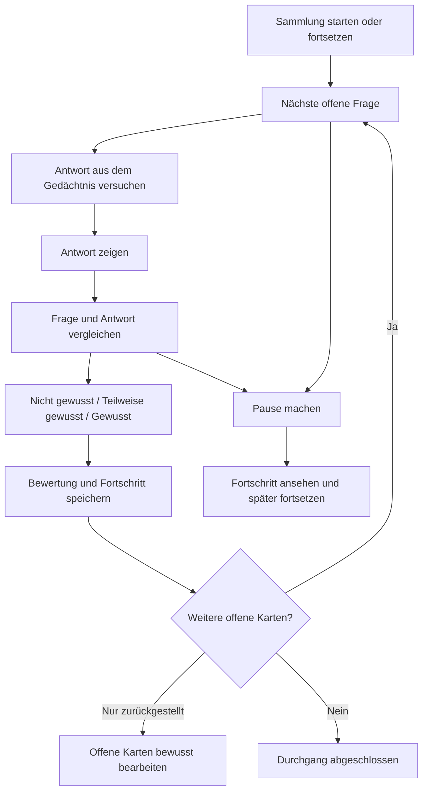

# Karteikarten: große Sammlungen nachvollziehbar durcharbeiten

Stand: 9. September 2026. Vom Nutzer zur Umsetzung und zum Web-Deployment freigegeben; umgesetzt gemäß [Implementierungsplan](../plans/2026-09-09-flashcard-learning-flow.md). Die untenstehenden Vergleiche halten die Begründung der Designentscheidung fest. Ein qualitativer Test mit Personen aus der Zielgruppe steht weiterhin aus.

## 1. Ziel und wichtigste Entscheidung

Der Nutzer hat als Hauptanwendungsfall ausdrücklich **große Sammlungen erstmals durcharbeiten** gewählt. Der normale Einstieg muss deshalb einen vollständigen, fortsetzbaren Durchgang ermöglichen. Nutzer sollen jederzeit verstehen, welchen Stoff sie bearbeiten, was bereits erledigt ist und warum als Nächstes genau diese Karte erscheint.

**Empfehlung: Ein gespeicherter Durchgang durch die Sammlung, ergänzt um bewusst gestartete Wiederholungen.** Die Bewertung einer Antwort verändert den Lernstand. Im ersten Durchgang verändert sie nicht die Reihenfolge der noch offenen Karten.

Eine Sammlung mit 800 Karten darf über viele kurze Lerneinheiten bearbeitet werden. Eine Pause beendet die heutige Lerneinheit, nicht den Durchgang. Es gibt keine versteckte Obergrenze von 40 Karten und keine automatische Wiederholungsschleife.

## 2. Was wir am bisherigen Ansatz hinterfragen

Die Diagnose hat folgende Abläufe mit der tatsächlichen Auswahllogik des Browseradapters und den Session-Funktionen der Vue-Ansicht reproduziert:

- Bei 100 Karten endet die Runde nach den ersten 40, obwohl 60 noch nicht bewertet wurden.
- Mit „Nochmal“ bewertete Karten werden nach den 40 Karten erneut vorgelegt. Weitere offene Karten werden nicht geladen.
- Ältere Wiederholungstermine können bei einer neuen Auswahl ungesehene Karten verdrängen.
- Übersprungene Karten können beim Neustart dieselben 40 Plätze belegen.
- Gegenprobe: Nach 40 Bewertungen mit „Gut“ werden bei einer gleichaltrigen Sammlung beim Neustart weitere neue Karten ausgewählt. Die Karten sind also nicht grundsätzlich gesperrt.

Weitere UX-Probleme im aktuellen Code:

- „Wiederholen“ ist auch die Bezeichnung für das allererste Lernen unbekannter Karten.
- Der allgemeine Einstieg wählt Karten über Sammlungen hinweg, ohne zuvor einen eindeutigen Lernkontext festzulegen.
- Der Zähler bezieht sich auf das geladene Paket und kann beim Wechsel auf die Wiederholungswarteschlange schrumpfen.
- „Gelernt“ in der Statistik bedeutet bisher mindestens einmal bewertet. Das sagt nicht, ob eine Karte beherrscht wird.
- „Nochmal“ bezeichnet eine Handlung; „Schwer“, „Gut“ und „Leicht“ beschreiben dagegen unterschiedliche Einschätzungen.
- „Vorherige“ und erneutes Bewerten können Lernaktivität und Navigation vermischen.
- Im Antwortzustand wird die Vorderseite ersetzt. Bei langen juristischen Antworten fehlt dadurch der unmittelbare Vergleich mit der Frage.
- „Aus Session entfernen“ erklärt weder Dauer noch Lernfolge ausreichend.
- Die Karte selbst wird als großer Button gerendert. Längere Texte, Textauswahl und darin enthaltene Links passen schlecht zu einer solchen Interaktion.

## 3. Drei mögliche Ansätze

| Ansatz | Vorteil | Nachteil | Entscheidung |
| --- | --- | --- | --- |
| Nur neue Karten höher sortieren | Kleine Änderung; verbessert die erste Auswahl | Löst weder das Ende nach 40 noch die Wiederholungsschleifen oder den fehlenden Fortsetzungszustand | Reicht nicht aus |
| Neue Karten und Wiederholungen automatisch mischen | Kann regelmäßige Wiederholung in den Alltag integrieren | Für das gewünschte erstmalige Durcharbeiten bleibt der Fortschritt schwer vorhersehbar; Mischquoten werden zu weiteren versteckten Regeln | Nicht als Standard für diesen Anwendungsfall |
| Sammlung fortlaufend durcharbeiten; Wiederholungen bewusst starten | Klarer Fortschritt, vollständige Abdeckung, jederzeit pausierbar | Wiederholungen müssen sichtbar angeboten werden, damit sie bei sehr großen Sammlungen nicht untergehen | Empfohlen |

Auch „erst alle neuen Karten, dann irgendwann wiederholen“ ist als globale Regel zu grob. Bei einer Sammlung mit tausenden Karten kann der erste Durchgang Wochen dauern. Wiederholungen müssen bereits währenddessen möglich und bei späteren Besuchen sichtbar sein. Sie dürfen den begonnenen Durchgang aber nicht selbstständig ersetzen.

Fachlicher Hintergrund: Wiederholter Abruf und zeitliche Abstände sind für langfristiges Behalten relevant. Die konkreten Studien untersuchen unter anderem Vokabeln; sie belegen keinen optimalen Ablauf für juristische Großsammlungen. Die vorgeschlagene Trennung ist eine Produktentscheidung aufgrund des hier genannten Lernziels. Sie ist keine Behauptung, dass vollständiges Durcharbeiten generell die lernpsychologisch beste Reihenfolge sei. Siehe [Karpicke und Roediger, 2008](https://learninglab.psych.purdue.edu/downloads/2008/2008_Karpicke_Roediger_Science.pdf) und [Kornell, 2009](https://web.williams.edu/Psychology/Faculty/Kornell/Publications/Kornell.2009b.pdf).

## 4. Ein verständliches Modell

Es gibt drei voneinander getrennte Dinge:

1. **Die Sammlung:** Welchen Stoff möchte ich bearbeiten?
2. **Der Durchgang:** Welche Karten dieses Stoffes habe ich bereits bearbeitet, welche fehlen noch? Dieser Stand bleibt über Tage erhalten.
3. **Die Lerneinheit:** Was mache ich gerade bis zur nächsten Pause? Ihre Länge bestimmt der Nutzer.

Der Lernstand gehört dauerhaft zur Karte. Eine Karte kann im Durchgang bearbeitet sein und trotzdem noch nicht gewusst werden. Ein einmaliger Erfolg ist ebenfalls keine Garantie für dauerhaftes Können.

### Verbindliche Begriffe

| Begriff | Bedeutung |
| --- | --- |
| Noch nicht bearbeitet | Keine gespeicherte Antwortbewertung vorhanden |
| Einmal bearbeitet | Mindestens eine Antwortbewertung gespeichert, unabhängig davon, ob die Antwort gewusst wurde |
| Zurückgestellt | Bewusst ohne Bewertung ausgelassen; weiterhin offen |
| Zuletzt gewusst / teilweise gewusst / nicht gewusst | Letzte Selbsteinschätzung, kein objektives Beherrschungsurteil |
| Pausierte Karte | Wegen ihrer Qualität derzeit vom Lernen ausgenommen |
| Wiederholung empfohlen | Eine bereits bewertete Karte sollte nach dem gespeicherten Wiederholungsplan erneut bearbeitet werden |

„Angezeigt“ oder „Antwort aufgedeckt“ zählt nicht als bearbeitet. „Noch nicht bearbeitet“ ist ehrlicher als „ungesehen“, weil bloßes Sehen bisher nicht zuverlässig erfasst wird. Neue Karten sind keine überfälligen Wiederholungen.

## 5. Einstieg: ein sinnvoller nächster Schritt

Der Bereich „Karteikarten“ zeigt die Sammlungen und, falls vorhanden, den zuletzt fortgesetzten Durchgang. Die bisherige zusätzliche Auswahlseite zwischen Wiederholen, Sammlungen und Statistik entfällt als Pflichtstation. Verwaltung und Statistik bleiben erreichbar.

Beispiel für eine Sammlung:

> **Zivilrecht**
> 84 von 320 Karten einmal bearbeitet
> 236 noch offen · davon 3 zurückgestellt
> **Durchgang fortsetzen**
> 12 Wiederholungen empfohlen · Wiederholen

Die primäre Aktion richtet sich nach dem Zustand:

| Zustand | Primäre Aktion |
| --- | --- |
| Noch keine Karte bearbeitet | Sammlung durcharbeiten |
| Begonnener Durchgang mit offenen Karten | Durchgang fortsetzen |
| Nur zurückgestellte Karten offen | 3 offene Karten bearbeiten |
| Alle lernbaren Karten einmal bearbeitet und Wiederholungen empfohlen | Empfohlene Karten wiederholen |
| Erstmalig vollständig bearbeitet, gerade keine Wiederholung empfohlen | Sammlung erneut durcharbeiten |
| Neue Karten nach einem vollständigen Durchgang hinzugefügt | 12 neue Karten bearbeiten |

Der Start führt unmittelbar zur nächsten passenden Frage. Es gibt keinen Pflichtdialog für Kartenanzahl, Zeitbudget, Schwierigkeitsstufe oder Algorithmus.

Der Home-Einstieg nennt die zuletzt verwendete Sammlung ausdrücklich: „Zivilrecht · Durchgang fortsetzen“. Ohne bisherigen Kontext führt er zur Sammlungsauswahl. Ein globaler Mix wird nie stillschweigend vorausgewählt.

Ein Filter gilt nur dann für das Lernen, wenn die Aktion das klar benennt, etwa „Diese 62 Karten durcharbeiten“. Umfang und Filter bleiben während dieses Durchgangs sichtbar. „Gesamte Sammlung durcharbeiten“ darf nicht versehentlich eine gefilterte Teilmenge verwenden.

## 6. Ablauf pro Karte

### Frage

- Oben stehen Sammlung, „Erster Durchgang“ und der Fortschritt der gesamten Auswahl.
- Die Frage ist die dominante Fläche. Titel oder Schlagwörter, die die Lösung verraten könnten, werden erst mit der Antwort beziehungsweise auf Wunsch gezeigt. Der Sammlungskontext bleibt sichtbar.
- Hauptaktion: **Antwort zeigen**. Kein Pflichtfeld und kein Zwang, die Antwort einzutippen.
- Sekundär: **Für später zurückstellen**. Kurze Erklärung beim ersten Mal: „Bleibt offen und kommt nach den übrigen Karten.“
- **Pause machen** bleibt jederzeit erreichbar.

### Antwort und Bewertung

Die Frage bleibt sichtbar, darunter erscheint die vollständige Antwort. Für juristische Karten bleiben Listen, Prüfungsschritte, Hervorhebungen und Quellen lesbar. Die App kürzt Antworten nicht automatisch. Das Aufdecken springt nicht ans Ende einer langen Antwort.

Ich empfehle drei Einschätzungen:

| Button | Entscheidungshilfe |
| --- | --- |
| **Nicht gewusst** | Die wesentliche Antwort fehlte oder war falsch. |
| **Teilweise gewusst** | Der Ansatz war richtig, aber wesentliche Punkte fehlten. |
| **Gewusst** | Die wesentliche Antwort war vor dem Aufdecken vorhanden. |

Die Frage darüber lautet **„Wie gut konntest du die Antwort?“** Bewertet wird der eigene Abruf vor dem Aufdecken, nicht die Verständlichkeit der nun gelesenen Lösung. Wortgleiche Wiedergabe wird nicht vorausgesetzt.

Warum drei? Die zusätzliche Entscheidung zwischen „Gut“ und „Leicht“ ist für diesen Einstieg weniger wichtig als eine zuverlässige Einschätzung. „Teilweise“ bildet außerdem einen naheliegenden Fall längerer juristischer Antworten ab. Dies ist eine zu überprüfende UX-Hypothese, keine wissenschaftlich bewiesene optimale Anzahl.

Mit der Bewertung geht es direkt zur nächsten offenen Karte. Es gibt keinen zusätzlichen Weiter-Button und keine erzwungene Motivationspause. **„Nicht gewusst“ zieht dieselbe Karte im ersten Durchgang nicht erneut nach vorne.**

Die letzte Bewertung lässt sich über **Bewertung rückgängig machen** korrigieren. Das führt zur Antwort der betreffenden Karte zurück und korrigiert auch Lernstand und Fortschritt. Bloßes Zurückblättern zum Nachlesen darf kein zusätzliches Lernereignis erzeugen.

## 7. Reihenfolge und Vollständigkeit

Der erste Durchgang verwendet eine stabile Reihenfolge. Eine ausdrücklich vorhandene Reihenfolge des Decks wird bevorzugt. Fehlt sie, wird einmal eine nachvollziehbare Reihenfolge festgelegt und gespeichert. Bearbeiten eines Kartentextes, Nachladen, Neustart und Gerätewechsel dürfen diese Reihenfolge nicht neu mischen.

Es gibt bereits ein `sort_index` für Cloud-Prompts innerhalb ihrer Items; daraus folgt keine vollständige Sammlungsreihenfolge über alle Karten. Der vorhandene gemeinsame Kartentyp enthält ebenfalls keine explizite Sammlungsposition. Eine echte Quellreihenfolge muss für alle Speicherpfade konsistent ergänzt werden. Für bestehende Decks darf keine angeblich ursprüngliche Reihenfolge erfunden werden.

Auswahlregeln:

1. Nur Karten aus dem gewählten Umfang und mit aktueller Lernfreigabe kommen infrage.
2. Noch nicht bearbeitete und nicht zurückgestellte Karten werden in der gespeicherten Reihenfolge angeboten.
3. Jede Bewertung entfernt die Karte aus den offenen Karten des ersten Durchgangs, unabhängig vom Ergebnis.
4. Zurückgestellte Karten werden nicht vergessen. Nach den übrigen Karten erscheint ein ausdrücklicher Einstieg in die verbleibenden offenen Karten.
5. Werden sie erneut zurückgestellt, endet diese Bearbeitung mit „3 Karten noch offen“. Es entsteht keine automatische Schleife. Beim nächsten Fortsetzen werden die offenen Karten wieder angeboten.
6. Die technische Paketgröße bestimmt nur, wie viele Karten im Hintergrund geladen werden. Sie ist weder Lernziel noch Abschlussbedingung.

Bereits vorhandene Bewertungen zählen bei der Einführung mit: Sind 40 von 100 Karten früher bewertet worden, zeigt die Sammlung „40 einmal bearbeitet“ und setzt bei den 60 offenen fort. Ein erneuter vollständiger Durchgang bleibt bewusst startbar, ohne die Bewertungshistorie zu löschen.

## 8. Fortschritt, Pause und Abschluss

Der zentrale Zähler zählt **unterschiedliche bearbeitete Karten**, nicht Klicks, Versuche oder geladene Karten:

> **84 von 320 einmal bearbeitet**
> Heute 18 weitere Karten · 236 noch offen

Die aktuelle unbewertete Frage erhöht den Zähler noch nicht. Wiederholen einer bekannten Karte erhöht die Aktivität, aber nicht erneut die Abdeckung. Zurückstellen erhöht die Abdeckung ebenfalls nicht. Bewertungen in einem anderen Lernmodus derselben Karte zählen für die erstmalige Abdeckung mit.

Eine Pause ist ein normaler Abschluss der heutigen Lerneinheit. Beispiel:

> **Für heute pausiert**
> Du hast 18 neue Karten bearbeitet.
> 12 gewusst · 4 teilweise gewusst · 2 nicht gewusst
> In der Sammlung sind noch 236 Karten offen.
> **Zur Sammlung** · Weiterlernen

Nach einer längeren Unterbrechung startet eine noch unbewertete Karte wieder auf der Frageseite. Bereits gespeicherte Bewertungen werden nicht wiederholt. Nach einem bloßen kurzen Pausieren innerhalb derselben geöffneten Ansicht kann die Antwortansicht erhalten bleiben.

Ein Durchgang endet erst, wenn die Karten seines Umfangs bearbeitet sind. Bei zurückgestellten oder ausgeschlossenen Karten ist die Einschränkung ausdrücklich sichtbar. „Einmal vollständig bearbeitet“ ersetzt ungenaues „Alles gelernt“.

Am echten Ende werden die letzten Selbsteinschätzungen zusammengefasst. Beispiel: „320 Karten einmal bearbeitet; 58 zuletzt nicht oder nur teilweise gewusst.“ Von dort sind **Unsichere Karten wiederholen**, **Sammlung erneut durcharbeiten** und **Zur Sammlung** möglich. Die App startet nichts davon automatisch.

Es gibt keine verpflichtende Rundenlänge. Ein freiwilliges Karten- oder Zeitziel kann später hinzukommen, ist für die erste Version aber nicht nötig. Auch ein solches Ziel darf künftig nur eine Pause anbieten und nie weitere offene Karten unsichtbar machen.

## 9. Wiederholen bleibt jederzeit möglich

Schon während des ersten Durchgangs gibt es auf der Sammlungsseite einen sekundären Einstieg für empfohlene Wiederholungen bereits bearbeiteter Karten. Beim Wiederkommen an einem späteren Tag darf ein ruhiger Hinweis erscheinen: „12 deiner bisherigen Karten sind zum Wiederholen empfohlen.“ Der Hauptbutton „Durchgang fortsetzen“ bleibt erhalten.

Die Nutzer entscheiden damit bewusst zwischen Fortschritt durch neuen Stoff und Festigen des bisherigen Stoffes. Nach einer Wiederholung gelangen sie zu ihrem gespeicherten Durchgang zurück.

Ein Wiederholungsdurchgang hat einen beim Start bestimmten Umfang. Jede ausgewählte Karte wird darin einmal bewertet. Die Priorisierung ordnet diese Karten anhand des Wiederholungsbedarfs; sie darf einzelne Karten nicht mehrfach vor den restlichen ausgewählten Karten einschieben. Erneutes Nichtwissen führt zu einer späteren Empfehlung und wird im Abschluss sichtbar. Es erzwingt keine Endlosschleife.

„Unsichere Karten wiederholen“ ist eine bewusst gewählte Auswahl nach letzter Einschätzung. Sie darf auch dann gestartet werden, wenn deren regulärer Wiederholungszeitpunkt noch nicht erreicht ist. Wenn keine Wiederholung empfohlen ist, lautet die Aussage „Aktuell keine Wiederholung empfohlen“; eine freiwillige Wiederholung bleibt möglich und wird auch so bezeichnet.

Für die erste Version bleiben die vorhandenen Terminberechnungen grundsätzlich verwendbar. Die neue Oberfläche darf keine Zeitversprechen anzeigen, die der gewählte Durchgang nicht einhält. Insbesondere entfällt „gleich nochmal“ im ersten Durchgang. Eine spätere Algorithmusentscheidung sollte anhand eigener Langzeitdaten erfolgen, nachdem Auswahl und Fortschritt verständlich funktionieren. Das [Anki-Handbuch](https://docs.ankiweb.net/deck-options.html#newreview-order) unterscheidet ebenfalls Auswahl, Reihenfolge und Wiederholung; seine vielen Einstellungen sind kein Vorbild für die Einstiegskomplexität dieser App.

## 10. Sonderfälle, die das Modell aushalten muss

| Situation | Erwartetes Verhalten |
| --- | --- |
| Nutzer bearbeitet täglich nur 10 von 800 Karten | Jeden Tag Fortsetzung bei offenen Karten; kein Zurückspringen auf eine bevorzugte Gruppe |
| Alle Antworten werden als nicht gewusst bewertet | Der Durchgang schreitet trotzdem durch alle Karten fort; der Lernbedarf bleibt gespeichert |
| Sammlung enthält nur eine schwierige Karte | Ein Versuch beendet den gewählten Durchgang; weiteres Üben erfordert eine bewusste Aktion |
| Nutzer stellt Karten zurück und schließt die App | Diese Entscheidung bleibt gespeichert; zunächst kommen andere offene Karten |
| App wird mitten in einer Antwort geschlossen | Gespeicherte Bewertungen bleiben erhalten; die unbewertete Karte bleibt offen |
| Netzverbindung fällt beim Bewerten aus | Keine falsche Erfolgsmeldung. Eine lokal dauerhaft gespeicherte Antwort darf weiterführen und später übertragen werden. Ohne solche Speicherung bleibt die Karte mit einer verständlichen Wiederholungsmöglichkeit stehen |
| Bewertung wird doppelt abgeschickt | Ein Lernereignis und ein Fortschrittsschritt, keine Doppelzählung |
| Mehrere Geräte oder Browserfenster | Gespeicherte Antworten werden abgeglichen und dedupliziert. Ein älterer Cursor darf keine erledigten Karten reaktivieren; noch nicht abgeglichene Offline-Zustände sind als solche erkennbar |
| Filter oder Sammlung werden gewechselt | Der bisherige Durchgang bleibt erhalten. Der neue Umfang wird vor Beginn klar bezeichnet |
| Während des Durchgangs kommen 50 neue Karten hinzu | Der laufende Umfang wächst nicht überraschend. Sichtbarer Hinweis „50 neue Karten hinzugekommen“; separater Anschluss nach dem bisherigen Durchgang |
| Eine Karte wird archiviert oder wegen Qualität pausiert | Nicht weiter abfragen; Änderung des Umfangs erklären, ausgeschlossene Karten separat ausweisen |
| Eine pausierte Karte wird wieder freigegeben | Als wieder verfügbare Karte sichtbar anbieten; keinen abgeschlossenen Durchgang heimlich zurücksetzen |
| Zugriff auf eine Sammlung entfällt | Verständlich erklären, lokale Antworten erhalten und ein anderes Lernziel anbieten |
| Eine Karte wird textlich überarbeitet | Kleine Änderungen behalten den Verlauf. Erhebliche inhaltliche Änderungen können bewusst zum erneuten Prüfen markiert werden; kein stilles Zurücksetzen |

Der aktuelle Umfang eines Durchgangs muss somit gespeichert sein. Sammlungsfortschritt über alle aktuellen Karten und Fortschritt dieses gespeicherten Durchgangs dürfen bei nachträglichen Ergänzungen nicht vermischt werden. In der Lernansicht steht dann beispielsweise „Durchgang: 84 von 320“ mit „50 neue Karten außerhalb dieses Durchgangs“.

## 11. Ruhige Oberfläche, gute Bedienbarkeit

- Ein dominanter nächster Schritt: erst Antwort zeigen, dann einschätzen, dann nächste Karte.
- Antworttexte sind normaler, auswählbarer Inhalt. Das Aufdecken erfolgt über einen echten Button; die gesamte Karte ist keine interaktive Textfläche.
- Auf kleinen Displays bleiben Frage, Antwort und Bewertung lesbar. Lange Lösungen dürfen scrollen; eine feste Aktionsleiste darf keinen Text oder Link verdecken.
- Desktop: Leertaste oder Enter zum Aufdecken, 1/2/3 zur Bewertung. Bewertungstasten funktionieren erst nach dem Aufdecken; gehaltene Tasten dürfen nicht mehrere Karten bearbeiten. Keine Shortcuts während Texteingaben oder in Dialogen.
- Screenreader erhalten sinnvolle Überschriften, Fokuswechsel und kurze Statusmeldungen. Bedeutung hängt nie nur an Farbe. Reduzierte Bewegung wird respektiert.
- „Karte melden / bearbeiten“ bleibt im Nebenmenü. „Nicht gewusst“ sagt nichts über die Kartenqualität aus. Bei Qualitätsproblemen erfolgt eine klare Auswahl „Diese Karte bis zur Überarbeitung pausieren“ mit verständlicher Bestätigung.
- „Aus Session entfernen“ entfällt; seine sinnvollen Fälle werden durch Zurückstellen oder Karte pausieren abgedeckt.
- Wolpi darf bei einer selbst gewählten Pause oder einem echten Abschluss erscheinen. Wiederkehrende Overlays mitten in der Antwort entfallen.
- Statistik heißt „Einmal bearbeitet“ und „Zuletzt gewusst“. Eine Aktivitätsserie bleibt optionaler Kontext, nicht das zentrale Ziel und kein Druckmittel beim Start.
- Sprechen ist ein optionaler Antwortweg innerhalb desselben Ablaufs. Eine vorgeschlagene Sprachauswertung ist erkennbar und korrigierbar; sie erzeugt genau eine Bewertung und steuert dieselbe nächste Karte. Sie eröffnet keine unabhängige Reihenfolge.

## 12. Technische Konsequenzen, ohne den Nutzer damit zu belasten

Die Änderung betrifft mehr als eine Sortierfunktion. Notwendig sind ein gemeinsames fachliches Modell für Auswahl und Durchgang sowie konsistente Umsetzung in Electron/SQLite, Browserfallback und Supabase.

Zu speichern sind der Benutzer, Sammlung beziehungsweise Auswahl, Art und Umfang des Durchgangs, stabile Reihenfolge sowie Bewertungen, zurückgestellte Karten und Fortsetzungszustand. Ein bloßer flüchtiger Array-Index oder eine ständig wachsende Ausschlussliste in einem Browser-Request genügt nicht für große Sammlungen und Gerätewechsel.

Serverseitige Auswahl und Pagination bleiben begrenzt. Auch das Nachladen darf nicht alle Kartentexte auf einmal abrufen. Der Abschluss richtet sich nach dem verlässlich gespeicherten Umfang und offenen Karten, nie nach einem temporär leeren Ladepuffer. Ladefehler und Ende des Durchgangs sind unterschiedliche Zustände.

Bestehende Bewertungen und Zeitpläne bleiben erhalten. Die Reduktion auf drei Eingaben braucht eine ausdrücklich dokumentierte Zuordnung für neue manuelle und Sprachbewertungen; alte Bewertungen mit dem Wert 4 werden nicht überschrieben. In der neuen Zusammenfassung können die bisherigen Kategorien „Gut“ und „Leicht“ gemeinsam unter „Gewusst“ erscheinen. Konkrete Terminänderungen und Schema-Migrationen gehören in einen späteren Implementierungsplan.

Undo benötigt eine Korrektur der Bewertung samt daraus abgeleitetem Zeitplan. Ein rein optisches Zurückspringen wäre unvollständig. Wiederholte Requests und die spätere Übertragung offline gespeicherter Bewertungen müssen idempotent sein.

## 13. Prüfen, bevor wir den Ablauf gut nennen

Das Konzept ist noch nicht mit Nutzern erprobt. Die folgenden Prüfungen entscheiden, ob es verständlich funktioniert:

### Kurzer Test mit Personen aus der Zielgruppe

Mit drei bis fünf Personen einen klickbaren Ablauf prüfen. Diese Zahl ist ein praktischer Start für qualitative Rückmeldungen, keine statistische Wirksamkeitsstudie.

1. Eine Sammlung mit 300 Karten beginnen, ohne Erklärung durch den Moderator.
2. Eine Antwort nicht wissen. Vorhersagen lassen, welche Karte als Nächstes kommt.
3. Eine Karte zurückstellen, pausieren und später fortsetzen.
4. Den Unterschied zwischen „84 bearbeitet“ und „zuletzt gewusst“ in eigenen Worten erklären lassen.
5. Eine versehentliche Bewertung korrigieren.
6. Bisherige Karten wiederholen und anschließend den ersten Durchgang fortsetzen.

Zu beobachten: falsche Erwartungen, Suchwege, unklare Buttons und Vertrauen in gespeicherten Fortschritt. Besonders die drei Bewertungsbegriffe und die Trennung von Durcharbeiten und Wiederholen müssen sich dabei bewähren.

### Verbindliche funktionale Beispiele

- 100 Karten, alle nicht gewusst: Die ersten 100 bewerteten Positionen enthalten 100 unterschiedliche Karten.
- Bei Karte 40 und 80 geht es ohne künstlichen Abschluss weiter.
- 3 Karten zurückstellen, 97 bewerten: Es bleiben genau 3 offene Karten, kein vollständiger Abschluss.
- Nach 23 Bewertungen neu starten: Die ersten 23 Karten werden im ersten Durchgang nicht erneut abgefragt.
- Einmalige Bewertung zweimal übertragen: Eine Bewertung, eine bearbeitete Karte.
- Bewertung zurücknehmen: Lernstand, Durchgangszähler und Wiederholungsplan stimmen wieder überein.
- Neue Karten während eines Durchgangs: Umfang und Zähler bleiben erklärbar, Ergänzungen sind sichtbar erreichbar.
- Keine empfohlenen Wiederholungen: Offene Karten bleiben lernbar und freiwilliges Wiederholen bleibt möglich.
- Dieselben Eingangsdaten führen in Web und Desktop zur gleichen fachlichen Auswahl.

## 14. Vorgeschlagene Umsetzung in sinnvoller Reihenfolge

**Zuerst die Verlässlichkeit:** gespeicherter Durchgang, stabile Auswahl, Nachladen, Fortsetzen, richtige Zähler, eindeutiges Ende, Zurückstellen und Schutz vor doppelten Bewertungen. Damit wird die Ursache des aktuellen Feedbacks behoben.

**Im selben Nutzerflow die Verständlichkeit herstellen:** Sammlung als Einstieg, Frage und Antwort gemeinsam anzeigen, klare Bewertung, Pause und Zusammenfassung, Undo sowie passende Hilfe- und Statistiktexte. Die Bewertung auf drei Eingaben wird im Entwurf überprüft, bevor vorhandene Eingaben umgestellt werden.

**Danach anhand der Nutzung verfeinern:** freiwillige Lernziele, zusätzliche Filter oder gemischtes Lernen und ein anspruchsvollerer Wiederholungsalgorithmus. Diese Erweiterungen sind kein Ersatz für einen verlässlichen ersten Durchgang.

Die wichtigste Zusage bleibt: **Ich kann meinen gewählten Stoff vollständig durcharbeiten, an jeder Stelle pausieren und nachvollziehbar weiterlernen.**
