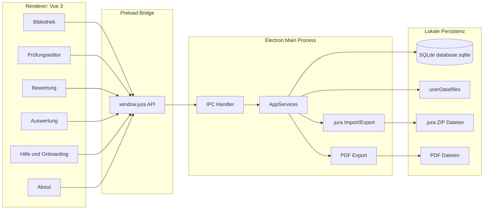
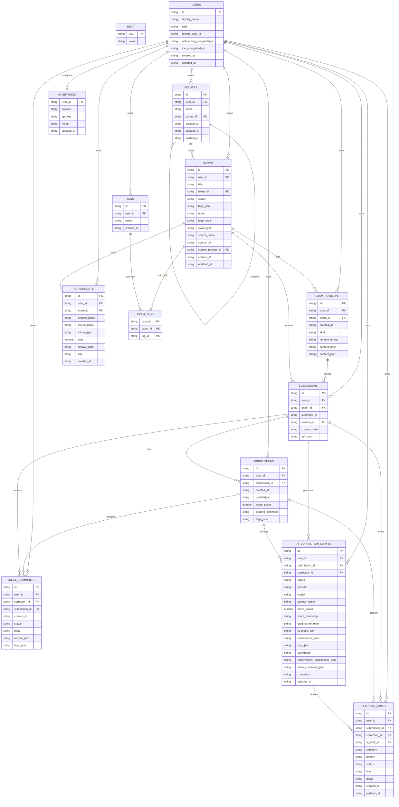
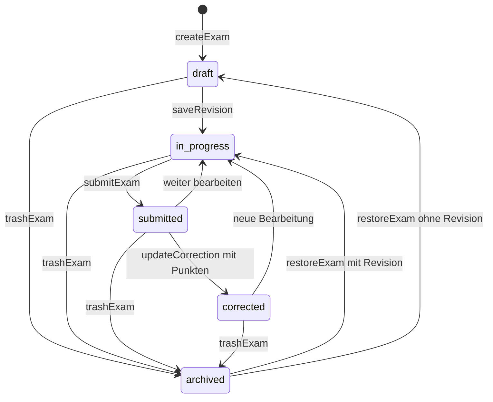
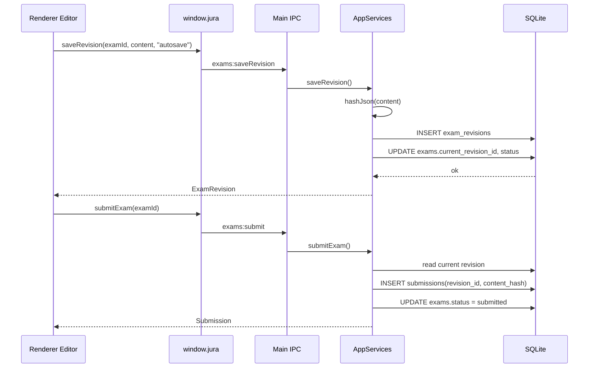
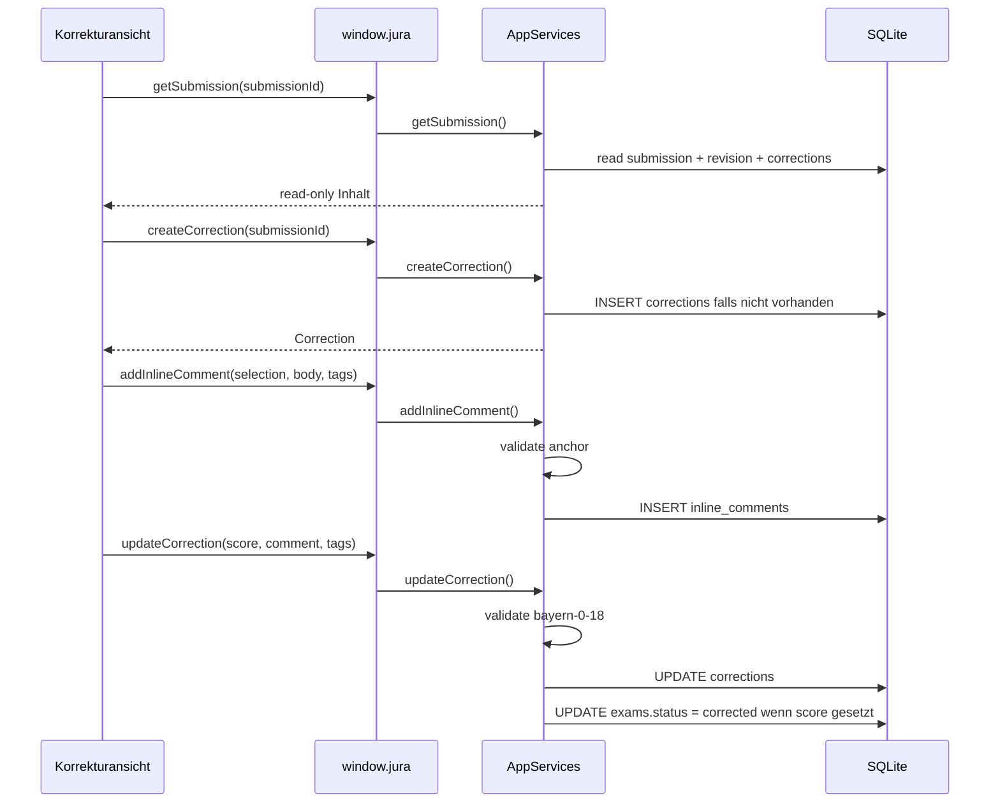
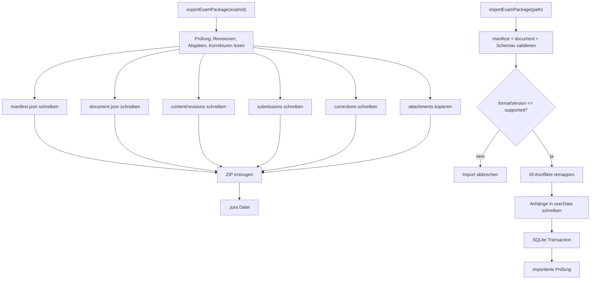
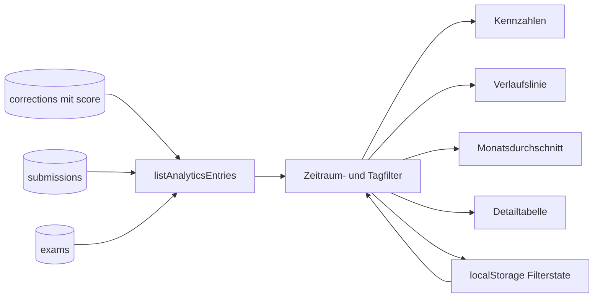
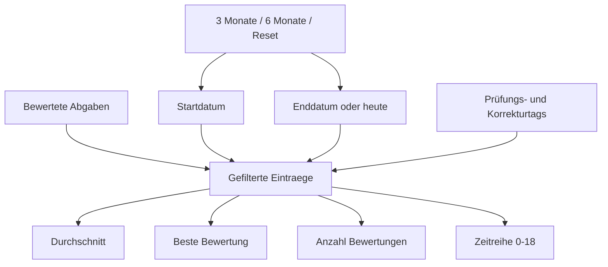
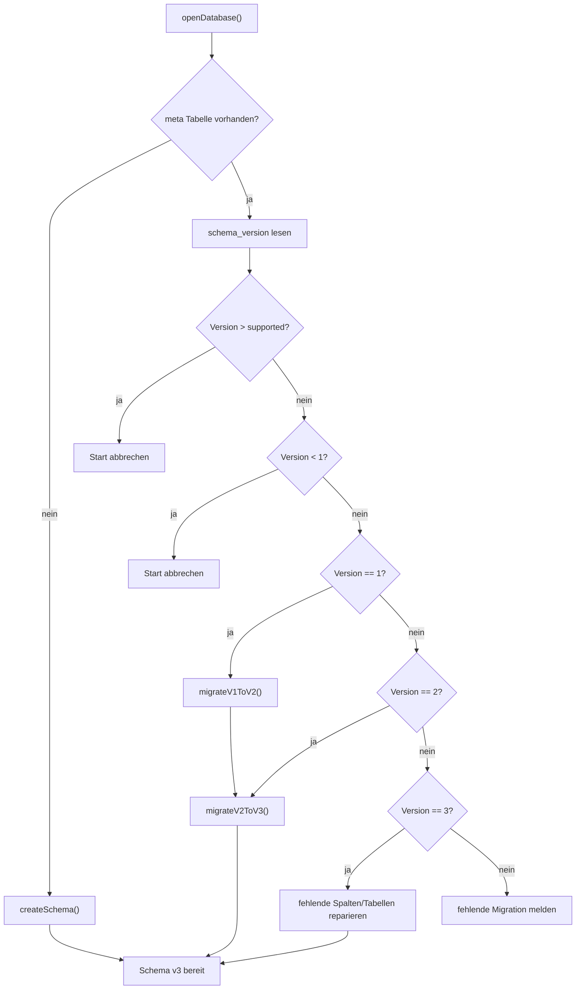
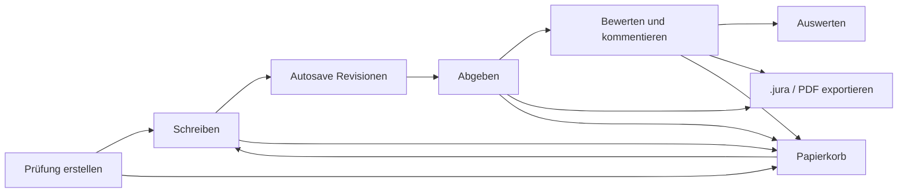

# Technische Dokumentation

Diese Dokumentation beschreibt die aktuelle Architektur von Jura Wolpertinger. Sie ist als Arbeitsgrundlage für Weiterentwicklung, Reviews und spätere Migrationen gedacht.

Stand: App `0.1.4`, Datenbank-Schema `3`, `.jura` Format `1`.

## Zielbild

Jura Wolpertinger ist eine lokale Desktop-App. Die Renderer-App zeigt Vue-Oberflächen, der Electron Main Process kontrolliert Datenbank, Dateien, PDF-Export und `.jura` Import/Export. Der Renderer greift nicht direkt auf SQLite oder das Dateisystem zu, sondern nutzt die sichere Preload-Bridge.



## Persistenz

Electron speichert produktive Daten unter `app.getPath("userData")`. Die App trennt strukturierte Daten und Dateien:

```text
database.sqlite
files/exams/<examId>/attachments/<attachmentId>/<storedName>
files/exams/<examId>/exports/...
backups/...
```

SQLite ist die Quelle für Nutzer, Prüfungen, Ordner, Revisionen, Abgaben, Bewertungen, Kommentare und Metadaten. Anhänge werden in den App-Speicher kopiert und über `attachments.relative_path` referenziert. Jede fachliche Zeile trägt eine `user_id`, damit lokale Nutzer getrennt bleiben und eine spätere Server-Synchronisation eindeutig mappen kann.

## Datenbankmodell



### Tabellen

| Bereich | Tabelle | Zweck | Wichtige Regeln |
| --- | --- | --- | --- |
| Versionierung | `meta` | Schema-, App- und Migrationsstand | `schema_version` wird beim Start geprüft |
| Nutzer | `users` | lokale, Demo- und später Remote-verknüpfte Nutzer | `current_user_id` liegt in `meta`; Onboarding-Status ist pro Nutzer |
| Organisation | `folders` | Ordnerbaum und Papierkorb für Ordner | `trashed_at` ist Soft-Delete |
| Prüfung | `exams` | Hauptobjekt mit Titel, Status, Tags, Notizen und Metadaten | `legal_area`, `exam_type`, `source_name`, `source_url` beschreiben die Prüfung; `status = archived` ist Papierkorb |
| Inhalt | `exam_revisions` | unveränderliche Editor-Versionen | Autosave und manuelles Speichern erzeugen neue Zeilen |
| Abgabe | `submissions` | Snapshot einer Revision | referenziert eine Revision und bleibt unverändert |
| Bewertung | `corrections` | Gesamtbewertung und Bewertungskommentar | Punkte werden per Zod auf `0-18` in `0.5` Schritten validiert |
| Inline-Kommentare | `inline_comments` | Kommentare auf Textauswahl | Anker speichern ProseMirror-Positionen plus Kontext |
| Dateien | `attachments` | Dateimetadaten | Datei liegt im App-Speicher unter `relative_path`; `role` unterscheidet Aufgabenstellung, Bearbeitervermerk, Musterlösung und Sonstiges |
| KI-Korrektur | `ai_correction_drafts` | Rohentwürfe aus einer KI-Korrekturanfrage | bleiben lokale Vorschläge bis Annahme oder Ablehnung |
| Lernaufgaben | `learning_tasks` | aus angenommenen KI-Entwürfen abgeleitete Aufgaben | lokale Auswertungsartefakte, nicht Teil des `.jura` Pakets |
| KI-Einstellungen | `ai_settings` | OpenAI-Schlüssel und Modell pro Nutzer | bleibt lokal und wird nie exportiert |
| Tags | `tags`, `exam_tags` | vorbereitetes normalisiertes Tag-Modell | aktuelle UI nutzt primär `tags_json` |

Hinweis zu `score_points`: Die Spalte stammt aus Schema v1 mit SQLite-Integer-Affinität. SQLite speichert halbe Punkte trotzdem korrekt als Zahl. Wenn später ein strikteres Datenbanksystem oder eine striktere Migration kommt, sollte die Spalte explizit auf `REAL` oder `NUMERIC` migriert werden.

## Nutzer und Synchronisation

`users.id` ist der lokale Besitz-Anker für alle Daten. Neue lokale Nutzer, der Demo-Nutzer und später verknüpfte Remote-Nutzer bekommen jeweils eine UUID. Beim Nutzerwechsel wird `meta.current_user_id` gesetzt; alle Listen, Exporte, Importe und Bewertungen lesen anschließend nur Daten dieses Nutzers.

Für eine spätere Anmeldung sollte die App lokale Daten nicht überschreiben. Stattdessen wird der lokale Nutzer mit einem Remote-Konto verknüpft (`remote_user_id`) und erst nach erfolgreicher Server-Bestätigung zusammengeführt. Konflikte lassen sich dadurch als Zuordnungsproblem lösen: lokale UUID, Remote-ID, Änderungszeit und Inhalts-Hash bleiben vergleichbar. Mehrere lokale oder Remote-verknüpfte Nutzer können deshalb nebeneinander existieren, ohne dass beim schnellen Wechsel Daten verloren gehen.

Onboarding ist ebenfalls nutzerbezogen. `onboarding_completed_at` verhindert, dass ein Nutzer die Einstiegstour erneut ungefragt sieht; `tour_completed_at` dokumentiert den Abschluss der Driver.js-Tour. Die Tour kann jederzeit über Hilfe oder Sidebar neu gestartet werden.

## Statusmodell



Die Abgabe ist kein Endzustand für die Bearbeitung. Nutzer können nach der Abgabe weiterarbeiten. Die Bewertung bleibt trotzdem an den abgegebenen Snapshot gebunden.

## Autosave und Abgabe



### Invarianten

- Jede Prüfung startet mit einer initialen TipTap-Revision.
- Autosave überschreibt keine alte Revision.
- `submissions.revision_id` zeigt auf die Revision, die abgegeben wurde.
- `submissions.content_hash` macht den Snapshot nachvollziehbar.
- Weiteres Bearbeiten nach Abgabe erzeugt neue Revisionen, verändert aber die bestehende Abgabe nicht.

## Korrekturmodell



Inline-Kommentare referenzieren eine Submission, nicht den aktuellen Arbeitsstand der Prüfung. Dadurch bleiben Kommentare stabil, auch wenn danach weitergeschrieben wird.

## KI-Korrektur

Die KI-Korrektur ist eine ausdrückliche Nutzeraktion und die einzige Stelle, an der normale Prüfungsdaten die lokale App verlassen. Der Renderer sieht weiterhin nur `window.jura`; API-Schlüssel, Dateizugriff, Promptbau und der Cloud-Aufruf laufen im Main Process über Services. Im MVP wird nur ein eigener OpenAI-Schlüssel unterstützt, den Nutzer:innen lokal hinterlegen.

Eine KI-Antwort wird zuerst als `ai_correction_drafts` gespeichert. Erst wenn der Entwurf angenommen wird, entstehen normale Korrekturen, Inline-Kommentare und Lernaufgaben in den bestehenden Tabellen. Ablehnen oder Überschreiben verändert die Abgabe nicht. `.jura` Pakete exportieren angenommene Korrekturen als normale Korrekturdaten, schließen aber Secrets, AI Settings, rohe oder nicht angenommene KI-Entwürfe und lokale Lernaufgaben bewusst aus.

## `.jura` Paketformat

`.jura` ist ein ZIP-Paket. Der Import validiert `manifest.json` und lehnt neuere unbekannte Formatversionen ab.

```text
example.jura
|-- manifest.json
|-- document.json
|-- content/
|   |-- current.json
|   `-- revisions/<revisionId>.json
|-- submissions/<submissionId>/
|   |-- submission.json
|   `-- content.json
|-- corrections/<correctionId>/
|   `-- correction.json
`-- attachments/<attachmentId>/
    |-- attachment.json
    `-- <originalName>
```



### Import-Regeln

- Bei ID-Konflikten werden neue UUIDs vergeben.
- Wenn eine Prüfung mit derselben ID existiert, bekommt der Importtitel den Zusatz `(importiert)`.
- `document.json` enthält die Prüfungsmetadaten `legalArea`, `examType`, `sourceName` und `sourceUrl`.
- `attachments/<id>/attachment.json` enthält die Attachment-Rolle; alte Pakete ohne Rolle werden als `other` importiert.
- AI Settings, API Keys, rohe KI-Entwürfe und Lernaufgaben sind keine Paketbestandteile.
- Anhänge werden vor der Datenbanktransaktion geschrieben und bei Fehlern wieder entfernt.
- Unbekannte neuere `.jura` Versionen werden abgelehnt.

## Auswertung

Die Auswertung basiert ausschliesslich auf bewerteten Korrekturen. Filterzustand liegt im Renderer unter `localStorage` mit dem Key `jura-wolpertinger-analytics-filters-v1`.





## IPC Oberflaeche

Der Renderer nutzt ausschliesslich `window.jura`. Die API ist in `src/shared/ipc.ts` typisiert und wird im Main Process auf sichere Handler gemappt.

| Bereich | API |
| --- | --- |
| Ordner | `listFolders`, `createFolder`, `updateFolder`, `trashFolder`, `restoreFolder` |
| Prüfungen | `listExams`, `createExam`, `getExam`, `updateExam`, `trashExam`, `restoreExam` |
| Schreiben | `saveRevision`, `submitExam` |
| Abgaben | `getSubmission` |
| Auswertung | `listAnalyticsEntries` |
| KI-Einstellungen | `getAiSettingsStatus`, `saveAiSettings` |
| KI-Korrektur | `generateAiCorrectionDraft`, `listAiCorrectionDrafts`, `acceptAiCorrectionDraft`, `rejectAiCorrectionDraft` |
| Lernaufgaben | `listLearningTasks`, `updateLearningTaskStatus` |
| Dateien | `addAttachment`, `openAttachment` |
| Austausch | `exportExamPackage`, `importExamPackage` |
| PDF | `exportExamPdf` |
| Korrektur | `createCorrection`, `updateCorrection`, `addInlineComment` |

## Migrationen

Beim Datenbankstart wird `meta.schema_version` gelesen. Neue Installationen erzeugen Schema v1 und wenden danach Migrationen bis zur aktuellen Version an.



Aktuelle Migrationen:

| Von | Nach | Änderung |
| --- | --- | --- |
| leer | 1 | Basis-Schema mit Prüfungen, Revisionen, Abgaben, Korrekturen, Kommentaren, Anhängen und Tags |
| 1 | 2 | `folders.trashed_at` für Soft-Delete von Ordnern |
| 2 | 3 | Prüfungsmetadaten, Attachment-Rollen, `ai_correction_drafts`, `learning_tasks`, `ai_settings` |

## Datenlebenszyklus



## Technische Leitplanken

- Kein Account und kein Hintergrundserver im MVP; Cloud-Aufrufe passieren nur bei ausdrücklicher KI-Korrekturanfrage mit lokal hinterlegtem eigenem OpenAI-Schlüssel.
- Keine harte Loeschung über die normale UI: Ordner nutzen `trashed_at`, Prüfungen den Status `archived`.
- Korrekturen dürfen den abgegebenen Text nicht verändern.
- `.jura` Daten werden immer über Zod-Schemas validiert.
- Renderer-Dateien und produktive Dateien haben unterschiedliche Quellen: `assets/submission.png` ist die zentrale Quelle für das Abgabe-Bild, der Renderer bekommt eine gespiegelte Kopie.
- Das Datenmodell ist versioniert. Neue Felder sollten entweder optional sein oder eine explizite Migration bekommen.

## Offene technische Punkte

- `tags` und `exam_tags` sind vorbereitet, die UI nutzt aktuell `tags_json`. Eine spätere Migration kann Tags normalisieren.
- `score_points` sollte in einer zukuenftigen Migration von Integer-Affinitaet auf eine explizite numerische Spalte umgestellt werden.
- Papierkorb für Prüfungen ist derzeit statusbasiert (`archived`), waehrend Ordner `trashed_at` nutzen. Wenn Wiederherstellung genauer werden soll, waere ein eigenes `exams.trashed_at` plus `previous_status` sauberer.
- PDF-Pfade sind im Schema vorgesehen. Die aktuelle Exportlogik gibt primär den gewählt gespeicherten Pfad zurück.
