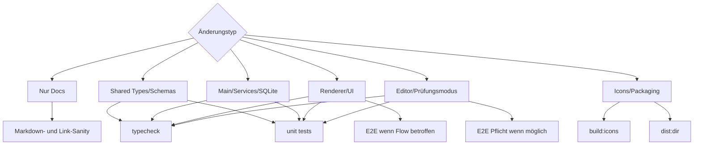

# CI Guidelines für Agents

Diese Guideline beschreibt, welche Checks für Jura Wolpertinger sinnvoll sind und wie Agents Änderungen vorbereiten sollen, damit CI reproduzierbar bleibt.

## Ziel

CI soll drei Dinge absichern:

- TypeScript-, Vue- und Electron-Code kompiliert.
- Datenmodell, Services, Schemas und Paketformat bleiben stabil.
- Kritische UI-Flows wie Schreiben, Abgeben, Bewerten und Auswerten funktionieren.

Aktuell gibt es Scripts in `package.json`, aber noch keine committed GitHub-Actions-Workflow-Datei. Diese Guideline ist die Grundlage für lokale Agent-Checks und eine spätere CI-Pipeline.

## Standard-Pipeline

```mermaid
flowchart LR
  Checkout["Checkout"]
  Setup["Node + pnpm"]
  Install["pnpm install --frozen-lockfile"]
  Typecheck["pnpm run typecheck"]
  Unit["pnpm test"]
  Build["pnpm run build"]
  E2E["pnpm run test:e2e"]
  Artifacts["Upload reports/artifacts"]

  Checkout --> Setup
  Setup --> Install
  Install --> Typecheck
  Typecheck --> Unit
  Unit --> Build
  Build --> E2E
  E2E --> Artifacts
```



## Checks

| Check | Befehl | Zweck | Wann ausführen |
| --- | --- | --- | --- |
| Install | `pnpm install --frozen-lockfile` | reproduzierbare Dependencies | CI immer |
| Typecheck | `pnpm run typecheck` | Vue, Renderer, Main und Shared Types | bei fast jeder Codeänderung |
| Unit/Service Tests | `pnpm test` | Schemas, Services, Datenmodell, Renderer-Helfer | bei Logik-, Schema- und Service-Änderungen |
| Build | `pnpm run build` | produktiver Electron-Vite-Build | vor PRs und Releases |
| E2E | `pnpm run test:e2e` | App-Flows über Playwright/Electron | bei UI-, Editor- und Abgabe-Änderungen |
| Packaging Smoke | `pnpm run dist:dir` | Electron-Builder Bundle ohne Installer | bei Icon-/Packaging-Änderungen |

## Änderungsbasierte Pflichtmatrix



## Agent-Regeln für CI

- Vor größeren Änderungen `AGENTS.md` und `docs/architecture.md` lesen.
- Den kleinsten passenden Check ausführen, nicht blind immer alles.
- Wenn ein Check fehlschlägt, Ursache analysieren und nicht einfach ignorieren.
- Wenn ein Check lokal nicht möglich ist, im Abschluss konkret nennen: Befehl, Grund, Risiko.
- Bei Schema-Änderungen Tests und Doku aktualisieren.
- Bei `.jura` Änderungen Import, Export und Schema-Validierung testen.
- Bei UI-Änderungen mindestens hellen und dunklen Modus bedenken.
- Bei Editor-Änderungen den Prüfungsmodus als kritischen Flow behandeln.
- Bei nativen Dependencies beachten: `better-sqlite3` wird für Node/Electron teilweise neu gebaut.

## Empfohlene GitHub Actions Vorlage

Diese Vorlage kann später als `.github/workflows/ci.yml` übernommen werden.

```yaml
name: CI

on:
  pull_request:
  push:
    branches:
      - main

jobs:
  checks:
    runs-on: macos-latest
    steps:
      - name: Checkout
        uses: actions/checkout@v4

      - name: Enable corepack
        run: corepack enable

      - name: Setup Node
        uses: actions/setup-node@v4
        with:
          node-version: 22
          cache: pnpm

      - name: Install dependencies
        run: pnpm install --frozen-lockfile

      - name: Typecheck
        run: pnpm run typecheck

      - name: Unit tests
        run: pnpm test

      - name: Build
        run: pnpm run build
```

E2E kann als separater Job laufen, weil er langsamer ist und Electron/Playwright mehr Umgebung braucht:

```yaml
  e2e:
    runs-on: macos-latest
    steps:
      - uses: actions/checkout@v4
      - run: corepack enable
      - uses: actions/setup-node@v4
        with:
          node-version: 22
          cache: pnpm
      - run: pnpm install --frozen-lockfile
      - run: pnpm run test:e2e
```

## Release- und Packaging-Checks

Packaging sollte getrennt von normaler PR-CI laufen, weil Signierung, notarization und Plattformartefakte eigene Anforderungen haben.

Empfohlen für lokale Release-Vorbereitung:

```bash
pnpm run build:icons
pnpm run dist:dir
```

Für macOS-Artefakte:

```bash
pnpm run dist:mac
```

## Artefakte

Sinnvolle CI-Artefakte bei Fehlern:

- Playwright Report
- Screenshots und Videos aus E2E-Läufen
- Electron Builder Logs
- Test Coverage, falls später aktiviert

## Merge-Kriterien

Ein PR sollte nicht gemerged werden, wenn:

- Typecheck fehlschlägt.
- Unit- oder Service-Tests fehlschlagen.
- Migrationen ohne Tests oder Doku geändert wurden.
- `.jura` Format/Schemas geändert wurden, ohne Import/Export zu testen.
- UI-Flows geändert wurden, ohne den betroffenen Flow lokal oder per E2E zu prüfen.
- Packaging/Icon-Änderungen ohne Packaging-Smoke landen.

## Bekannte technische Besonderheiten

- `better-sqlite3` ist nativ und kann zwischen Node- und Electron-Runtime Rebuilds brauchen.
- `pnpm run test:e2e` baut die App und ist deshalb deutlich langsamer als `pnpm test`.
- Der App-Name und zentrale Assets müssen mit dem Packaging konsistent bleiben.
- Diese App ist lokal und nicht-kommerziell. CI darf keine Cloud- oder Account-Pflicht einführen.
